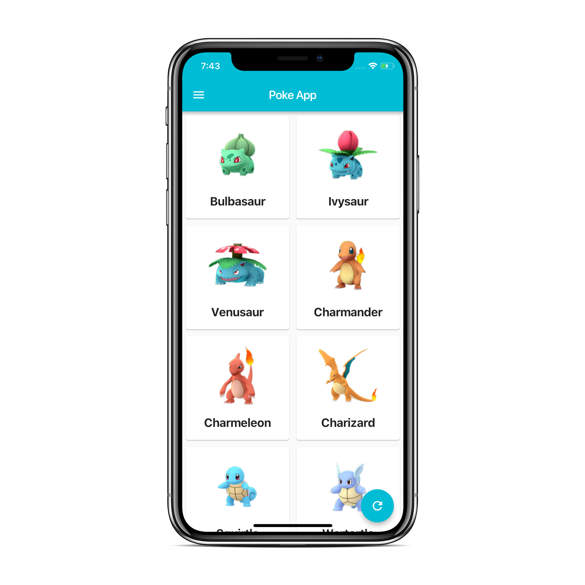

# Pokemon App
Welcome to the PokemonApp project! This is a mobile application built with Dart and Flutter that allows users to explore information about Pokemon creatures, including their abilities, types, and stats. The app provides a rich and interactive experience for Pokemon enthusiasts to learn more about their favorite creatures.

## Features
1. **Pokemon Data:** Retrieves and displays data about various Pokemon creatures, including their names, types, abilities, and stats.

2. **Search Functionality:** Enables users to search for specific Pokemon by name or type to quickly access information about them.

3. **Detailed Information:** Provides detailed information about each Pokemon, including its abilities, type matchups, and base stats.

4. **Favorites:** Allows users to mark Pokemon as favorites for easy access and tracking.

5. **Interactive UI:** Offers an intuitive and user-friendly interface with smooth animations and transitions for an engaging user experience.

## Installation
To run the PokemonApp on your device, follow these steps:

1. **Clone the Repository:** Clone the repository to your local machine using the following command:

git clone https://github.com/RadinaAvramova/PokemonApp.git

2. **Navigate to the Directory:** Change your current directory to the location of the cloned repository:

cd PokemonApp

3. **Run the Application:** Use Flutter to run the application on your preferred device or emulator:

flutter run

## Usage
1. **Launch the App:** Open the PokemonApp on your device or emulator.

2. **Explore Pokemon:** Browse through the list of Pokemon creatures to discover information about each one.

3. **Search for Pokemon:** Use the search functionality to find specific Pokemon by name or type.

4. **View Details:** Tap on a Pokemon to view detailed information, including its abilities, type matchups, and base stats.

5. **Mark Favorites:** Mark your favorite Pokemon for easy access and tracking by tapping on the heart icon.

6. **Interact with UI:** Enjoy the interactive user interface with smooth animations and transitions while exploring Pokemon data.

## Customization
1. **UI Themes:** Customize the app's visual appearance by implementing different themes and color schemes.

2. **Localization:** Implement localization support to provide translations for users in different regions.

3. **Additional Features:** Extend the app's functionality with features such as Pokedex integration, battle simulations, or community features for Pokemon fans.

## Screenshots

